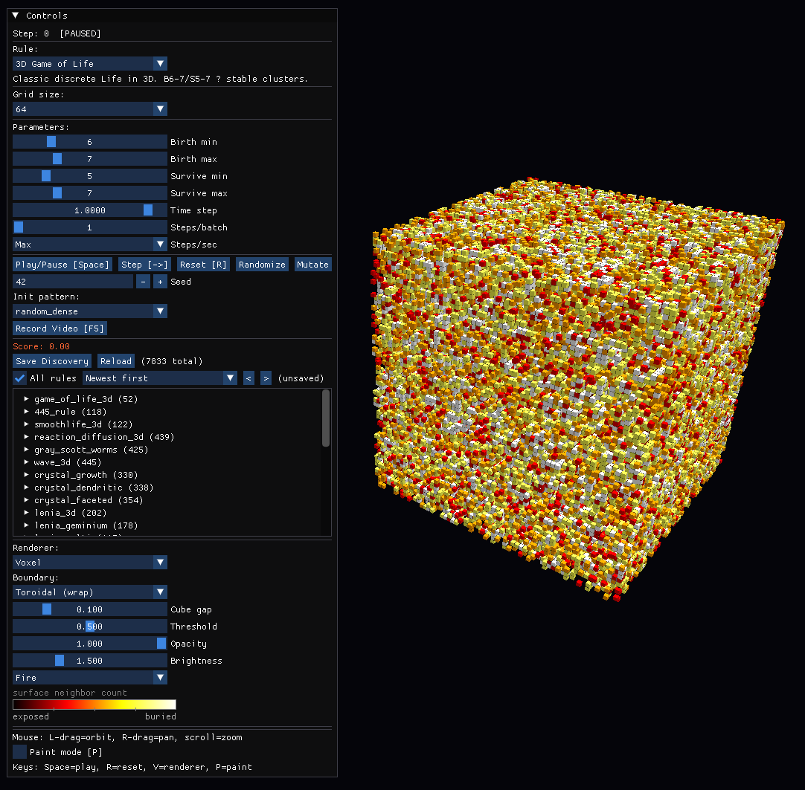
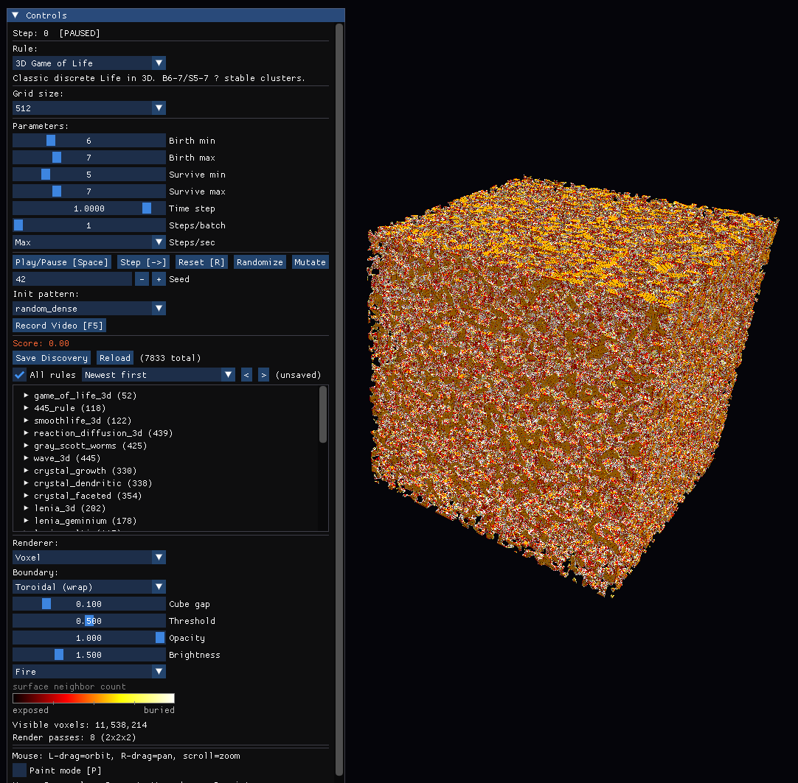

# 3D Cellular Automata

A GPU-accelerated 3D cellular automata simulator with real-time volumetric ray marching, 26 compute shader rules, and 46 presets — from classic Game of Life to quantum mechanics.


> **Work in progress** — experimental voxel and volumetric CAs. Expect rough edges.

## Features

- **26 GPU compute shader rules** running on OpenGL 4.3 compute shaders
- **Real-time volumetric rendering** via ray marching with emission-absorption model
- **46 built-in presets** with tunable parameters
- **Interactive UI** with imgui — adjust parameters, camera, rendering in real-time
- **Grid sizes from 32³ to 512³** with automatic format switching (rgba32f → rgba16f)
- **Resolution-independent physics** — h² Laplacian scaling keeps behavior consistent across grid sizes
- **Recording system** — capture parameter snapshots + MP4 video
- **Headless test harness** for automated parameter sweeps and discovery search

### Rule Categories

| Category | Rules | Description |
|----------|-------|-------------|
| **Classic** | Game of Life, SmoothLife | Discrete and continuous life-like automata |
| **Reaction-Diffusion** | Gray-Scott, BZ, Barkley, Morphogen | Chemical pattern formation — spots, spirals, waves |
| **Continuous** | Lenia, Multi-channel Lenia | Kernel-based continuous CAs with lifelike organisms |
| **Physics** | Wave, EM Wave, Schrödinger (×6) | Wave equations, quantum mechanics, tunneling, orbitals |
| **Materials** | Crystal Growth, Cahn-Hilliard, Fracture, Erosion | Phase separation, nucleation, elastic fracture |
| **Biology** | Predator-Prey, Flocking, Physarum, Mycelium, Lichen | Population dynamics, swarm behavior, fungal networks |
| **Astrophysics** | Galaxy Formation | N-body gravity with gas dynamics |
| **Chemistry** | Element CA, Viscous Fingers, Fire | 118-element particle chemistry, fluid instabilities, combustion |

## Getting Started

### Requirements

- Python 3.10+
- OpenGL 4.3 capable GPU (NVIDIA, AMD, or Intel — nouveau has limited compute shader support)
- Linux, macOS, or Windows

### Installation

```bash
git clone https://github.com/c0re-i5/3d-cellular-automata.git
cd 3d-cellular-automata
python -m venv .venv
source .venv/bin/activate  # Windows: .venv\Scripts\activate
pip install -r requirements.txt
```

### Running

```bash
python simulator.py
```

Use the imgui panel to switch presets, adjust parameters, and control the simulation.

#### Keyboard Controls

| Key | Action |
|-----|--------|
| **Space** | Pause / Resume |
| **R** | Reset simulation |
| **F** | Toggle fullscreen |
| **Tab** | Cycle through presets |
| **1-4** | Switch rendering mode |
| **Mouse drag** | Rotate camera |
| **Scroll** | Zoom |

### Headless Testing

```bash
python test_harness.py
```

Runs automated parameter sweeps, scores results by interestingness metrics, and saves discoveries to `discoveries.json`.

## Architecture

```
simulator.py       — Main simulator: GLSL shaders, rendering, UI (~8800 lines)
element_data.py    — Periodic table data for the Element Chemistry rule
test_harness.py    — Headless parameter sweep and discovery engine
discoveries.json   — Saved interesting parameter configurations
```

All 26 compute shaders are embedded in `simulator.py` as GLSL source strings, compiled at runtime via moderngl. The rendering pipeline uses a separate ray marching fragment shader with emission-absorption volume integration.

### Compute Shader Design

Each rule is a GLSL compute shader dispatched over an 8×8×8 workgroup grid. A shared `COMPUTE_HEADER` provides:

- Ping-pong textures (`u_src` / `u_dst`) as 3D `image3D` bindings
- Resolution-independent scaling via `h_sq` and `h_inv` (referenced to 128³)
- Boundary handling (toroidal wrap or clamp)
- Utility functions: `fetch()`, `fetch_interp()`, `hash_temporal()`

Shaders that use large neighborhood radii (SmoothLife, Lenia) have an optimized shared memory tiling path with automatic fallback for drivers that don't support it.

## Mathematical Reference

Every rule below runs as a GLSL compute shader on a 3D grid. All spatial derivatives use the 7-point stencil Laplacian $\nabla^2 f = \sum_{\text{nn}} f - 6f$, scaled by $h^2 = (128/N)^2$ for resolution independence. Gradients use central differences scaled by $h^{-1} = N/128$.

---

### Classical Automata

**Game of Life 3D** — Discrete totalistic rule on the 26-cell Moore neighborhood:

$$s^{t+1} = \begin{cases} 1 & \text{if } s^t = 0 \;\wedge\; b_1 \le N_{26} \le b_2 \\\ 1 & \text{if } s^t > 0 \;\wedge\; s_1 \le N_{26} \le s_2 \\\ 0 & \text{otherwise} \end{cases}$$

**SmoothLife 3D** (Rafler) — Continuous generalization with concentric spherical shells at radii $r_i = 1.5 h^{-1}$, $r_o = 2.5 h^{-1}$. Inner mean $m$ and outer mean $n$ drive a smooth sigmoid transition:

$$s^{t+1} = s^t + \Delta t \left(2\,\sigma\!\left(n,\; \ell(m),\; h(m),\; 0.03\right) - 1\right)$$

where $\sigma(x, a, b, w) = S(x,a,w)(1 - S(x,b,w))$ with $S(x,c,w) = (1 + e^{-(x-c)/w})^{-1}$, and $\ell, h$ interpolate between birth and survival intervals based on $m$.

---

### Reaction-Diffusion

**Gray-Scott** — Two-species feed-kill system producing spots, worms, and mitotic patterns:

$$\partial_t U = D_U \nabla^2 U - UV^2 + F(1-U)$$
$$\partial_t V = D_V \nabla^2 V + UV^2 - (F+k)V$$

**BZ (Complex Ginzburg-Landau)** — Normal form of the Belousov-Zhabotinsky oscillating reaction, writing $A = u + iv$:

$$\partial_t A = \mu A + (1 + i\alpha)D\nabla^2 A - (1 + i\beta)|A|^2 A$$

**Barkley** — Fast-slow excitable medium with stochastic nucleation:

$$\partial_t u = \varepsilon^{-1}\,\xi(v)\,u(1-u)\!\left(u - \tfrac{v+b}{a}\right) + D_u \nabla^2 u, \qquad \partial_t v = u - v$$

**Morphogen (Gierer-Meinhardt)** — Turing instability with activator saturation:

$$\partial_t a = D_a \nabla^2 a + \rho\!\left(\frac{a^2}{h(1 + \kappa a^2)} - a\right) + \sigma_a, \qquad \partial_t h = D_h \nabla^2 h + \rho(a^2 - h)$$

---

### Continuous CA (Lenia Family)

**Lenia 3D** — Gaussian ring kernel convolution with Gaussian growth function:

$$K(r) = \exp\!\left(-\tfrac{1}{2}\left(\tfrac{r/R - \beta}{0.15}\right)^2\right), \qquad U = \frac{\sum_j s_j K(|\mathbf{x}_j - \mathbf{x}|)}{\sum_j K(|\mathbf{x}_j - \mathbf{x}|)}$$

$$s^{t+1} = \text{clamp}\!\left(s^t + \Delta t\left(2e^{-\frac{(U-\mu)^2}{2\sigma^2}} - 1\right),\; 0,\; 1\right)$$

**Multi-Channel Lenia** — Three species with cyclic cross-coupling. Two kernels at ring positions $0.3$ (inner) and $0.7$ (outer) with cross-channel potentials:

$$P_a = \bar{S}^{\text{inner}}_a + \chi\,\tfrac{1}{2}(\bar{S}^{\text{outer}}_b + \bar{S}^{\text{outer}}_c)$$

Each channel has a Gaussian growth function with slightly shifted $\mu$ for symmetry breaking.

---

### Wave / Field Equations

**Wave 3D** — Symplectic Euler integration of the damped wave equation with an optional sinusoidal source:

$$\partial_t v = c^2 \nabla^2 u - \gamma v + A_d \sin(\omega_d t)\,\mathbf{1}_{|\mathbf{x}-\mathbf{x}_0| < r_s}, \qquad \partial_t u = v$$

**EM Wave** — TE-like Maxwell FDTD: $E_z$ driven by curl of $(B_x, B_y)$, magnetic fields updated by curl of $E_z$, with conductor absorption.

---

### Quantum Mechanics

**Schrödinger 3D** — Time-dependent Schrödinger equation via Yee leapfrog (symplectic, norm-conserving):

$$i\hbar\,\partial_t \Psi = -\frac{\hbar^2}{2m}\nabla^2\Psi + V(\mathbf{r})\Psi$$

Split into real/imaginary parts with staggered updates. 6 presets: hydrogen atom, orbital, wavepacket, harmonic oscillator, tunneling, double-slit.

**Schrödinger-Poisson** — Adds self-consistent Hartree mean-field: $\nabla^2 V = -\alpha|\Psi|^2$, solved via SOR Jacobi relaxation each frame.

**Molecular Schrödinger** — Two-center softened Coulomb potential for bonding/antibonding orbitals:

$$V(\mathbf{r}) = -\frac{Z}{\sqrt{|\mathbf{r}-\mathbf{R}_1|^2 + r_s^2}} - \frac{Z}{\sqrt{|\mathbf{r}-\mathbf{R}_2|^2 + r_s^2}}$$

---

### Ecology / Population Dynamics

**Predator-Prey (Rosenzweig-MacArthur)** — Holling type II functional response with prey logistic growth:

$$\partial_t u = ru(1 - u) - \frac{auv}{1+ahu} + D_u\nabla^2 u, \qquad \partial_t v = \frac{eauv}{1+ahu} - dv + D_v\nabla^2 v$$

**Lichen** — Three-species Lotka-Volterra competition for space and a shared resource, with asymmetric growth rates and competition coefficients.

**Flocking (Vicsek)** — Active matter with velocity alignment, pressure repulsion, and semi-Lagrangian density advection:

$$\mathbf{v}^{t+1} = (1-\alpha\Delta t)\mathbf{v}^t + \alpha\Delta t\,v_0(1+2\bar\rho)\hat{\mathbf{v}}_{\text{avg}} - \kappa(\bar\rho - 0.3)\nabla\rho\;\Delta t$$

**Physarum** — Slime mold chemotaxis: agents follow trail gradients via semi-Lagrangian advection, depositing and evaporating pheromone.

**Mycelium** — Agent-based fungal network: tip extension with nutrient-gradient-biased branching, anastomosis, and starvation death.

---

### Oscillator / Synchronization

**Kuramoto 3D** — Coupled phase oscillators on a 3D lattice with Hebbian frequency adaptation:

$$\dot\theta_i = \omega_i\Omega + \frac{K}{26}\sum_{j\in\mathcal{N}_{26}}\sin(\theta_j - \theta_i) + \eta_i, \qquad \dot\omega_i = \lambda R_i(\langle\omega\rangle_\mathcal{N} - \omega_i)$$

---

### Phase-Field / Materials

**Crystal Growth (Kobayashi)** — Anisotropic phase-field with cubic harmonics on the interface normal:

$$\partial_t \phi = \beta(\hat{n})^2\nabla^2\phi + 30\beta^2\phi(1-\phi)\!\left(\phi - \tfrac{1}{2} + \Delta + \tfrac{u}{2}\right)$$
$$\partial_t u = D\nabla^2 u - \tfrac{1}{2}\partial_t\phi$$

where $\beta(\hat{n}) = 1 + \varepsilon(n_x^4 + n_y^4 + n_z^4 - 3/5)$.

**Cahn-Hilliard** — Spinodal decomposition via fourth-order diffusion of the chemical potential:

$$\mu = c^3 - c + \alpha_{\text{asym}} - \varepsilon^2\nabla^2 c, \qquad \partial_t c = M\nabla^2\mu$$

**Fracture** — Elastic wave propagation with irreversible integrity loss when $|\sigma| > \sigma_c(1 - 0.03 N_{\text{broken}})$.

**Erosion** — Hydraulic erosion with gravity-driven fluid, shear-rate erosion, and velocity-dependent deposition.

---

### Fluid / Transport

**Viscous Fingers (Saffman-Taylor)** — Pressure-driven invasion with viscosity-dependent mobility:

$$p_{ijk} \leftarrow (1-\omega)p_{ijk} + \omega\frac{\sum_{\text{nn}}\bar\lambda\,p_{\text{nn}}}{\sum_{\text{nn}}\bar\lambda}$$

$$\partial_t S = \lambda\xi\sum_{\text{nn}}\max(0, p_{\text{nn}} - p)(S_{\text{nn}} - S) + \gamma\nabla^2 S$$

**Fire** — Combustion front with temperature diffusion, fuel consumption, oxygen transport, and rising embers.

---

### Astrophysics

**Galaxy Formation** — Multi-scale self-gravity with semi-Lagrangian advection:

$$\mathbf{F}_g = G\rho\!\left(\nabla\rho\big|_1 + \tfrac{1}{2}\nabla\rho\big|_2 + \tfrac{1}{4}\nabla\rho\big|_4\right)$$

$$\partial_t\mathbf{v} = \mathbf{F}_g - P\nabla\rho/\rho + \tfrac{\nu}{2}\nabla^2\mathbf{v} + \Lambda\hat{\mathbf{r}}\cdot 0.01$$

---

### Chemistry

**Element CA** — Particle-based system with all 118 elements, reaction rules, phase transitions, and electronegativity-driven bonding (separate shader and data file).

---

## Screenshots

| 64³ grid | 512³ grid |
|----------|-----------|
|  |  |

*3D Game of Life (B6-7/S5-7) — voxel renderer with surface neighbor count coloring. 11.5M visible voxels at 512³.*

## License

MIT
